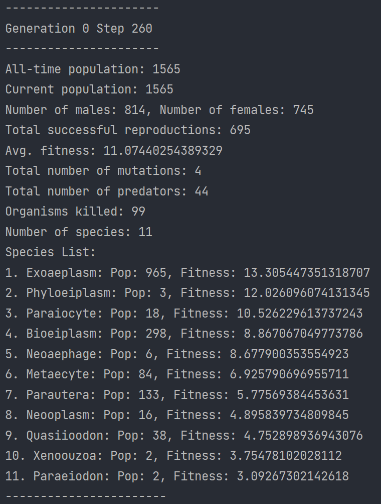

# Cellular Automata Simulator

This project is dedicated to the simulation of life-like organisms using genomes to generate
biomimetic neural networks. The purpose of this project is to observe what patterns and behavior
the digital organisms exhibit and see if they resemble real life. Although artificial 
intelligence using backpropagation to learn, it is unlikely the brain uses this 
mechanism, due to biological implausibilities. For example, networks that employ 
backpropagation are rate based instead of spiking neural nets, and violate Dale's
law: neurons in the brain form either excitatory or inhibitory connections [2]. However, 
artificial neurons are usually able to form both these connections. It is more possible
however, that in biological learning, thousands of genes are evolved over many 
generations to enable efficient learning for trillions of synapses. Hence, the simulation
of our digital organisms will operate on the basis of evolutionary algorithms.

This project is written in Python. The numpy library has been used for most of our neural
network and math operations. In addition, the opencv library has been used to render the
world frame, so that we can visualize the organisms.


### Running Simulation

Install dependencies and run simulation
```
pip install -r requirements.txt
python3 src/main.py
```

In addition to the UI, you can see the monitor for the simulation in the console when 
the main file is run.



## Design Implementation

The core of this project is built upon the foundation of evolutionary algorithms, which use
the phenomena of evolution to solve optimization problems. They have been 
used in the past for a multitude of applications, ranging from machine learning, 
agriculture, finance, research to art. One of the most popular evolutionary algorithms is
known as Neuroevolution of Augmenting Topologies (NEAT) [2], and this project has taken great
inspiration from it. In contrast to artificial neural networks (ANN), which generally have a fixed network
topology during both training and inference (inference might leave certain layers out 
like dropout), NEAT's network topology changes and evolves. It may start
out as a simple few neuron network with minimal connections, but at the end of the training stage,
it may be many layers deep with a significant number of synaptic connections. This is the beauty of such
evolutionary algorithms, instead of fixing our network topology, we optimize both the network
architecture and its parameters, the weights and biases. NEAT, in particular, 
has been shown to be incredibly effective for all sort of complex control tasks, 
like Pole Balancing.

There are four main steps to an evolutionary 
algorithm:

1. Generate the **initial population** of organisms randomly.
2. **Select the fittest organisms** for reproduction.
3. Breed organisms via **crossover** and **mutation** of genes to give birth to offspring.
4. Replace least-fit individuals with new individuals.


While step 4 is an extremely valuable step for an optimization problem, for the purposes
of our simulation we will ignore this, as organisms with less fitness will naturally
die out in favor of the fitter organisms (natural selection). 

Step 1 involves creating the initial population of organisms. First we must randomly
generate the **genome** for the Organism, which is a set of genes for the organism (defined
gene length). One gene can be thought of as a synaptic connection (with weight) between a source and 
sink neuron. We have a defined set of input and output neurons, as well as an arbitrary number of 
hidden neurons (set in .env file). For the time being, we do not allow any self 
and feedback connections. Once we have defined our genome, we can then build the brain
wiring. Using the genes (i.e. prospective synaptic connections) we connect the 
neurons in an adjacency matrix representation. After building the initial brain wiring, 
there may be a bunch of useless connections, for example hidden neuron not connected
to an output or input neuron. In this instance, we must cull all synaptic connections 
to this neuron, which will help save system resources. Once this is complete, the 
Organism's Neural Network is formed.

Step 2 is also a step specific to an optimization algorithm like NEAT. In our case, while there is
no such fitness check, the Organism's fertility (same species or cross-species) must be greater than
a random number between 0 and 1. The Organism's same species and cross-species fertilities 
are randomized at creation, and it is the probability that the Organism will engage in
sexual reproduction with a partner of the opposite sex. Naturally, the same species fertility
will generally be higher than the cross species fertility. Furthermore, sexual partners must be
within a certain vicinity of each other, and must be of a minimum age, in order to reproduce
successfully.

Step 3 is where the real magic happens. Once Organisms pass the criteria for reproduction, 
a process known as **crossover**, or recombination of genes begins to form the genome of the 
offspring. In a NEAT-like fashion, we compare alike genes, and select the gene from the 
fitter parent. By picking genes from the fitter parent, we are in essence optimizing the 
child's genome. It is worth an experiment in the future to have a random probability 
helping us select the gene which is transmitted to the child. If there are disjoint genes, 
we simply include all of them in the child's genome. 

Once recombination is over, perhaps the
most important process of the evolutionary algorithm occurs: **mutation**. Mutation is the equivalent 
of backpropagation in ANNs. This is incredibly powerful because 
it introduces genetic diversity, which helps organisms adapt and survive. A popular 
example of mutation is the peppered moth, also dubbed as 'Darwin's moth'. In the 19th century,
the black form of the moth became more common than its pale counterpart. This was during the 
Industrial Revolution, and the domestic coal fires had darkened the tree trunks and walls. 
The pale form of the peppered moth was easily observable to predators, and the black 
form was camouflaged, thus being able to survive and produce offspring. By 1895, 98% of peppered moths
in Manchester were black.


In the context of optimization, mutation in evolutionary algorithms also 
helps balance exploration vs exploitation, since by injecting randomness into the system, we 
can explore more of the search space of solutions. This also helps with avoiding premature convergence and
falling into the local minima trap. Hence, after the recombination of genes, with a relatively
low probability, mutation may take place in the child's genome.

This completes the baseline implementation of an evolutionary algorithm. Beyond this lies 
the method we use to create the neural network along with the associated input, 
output and hidden neurons. Furthermore, I will discuss the specifics of reproduction, mutation,
fitness function as well as speciation. Then we will analyze the results of the simulations and the
keys takeaways from the project. I will also list items that are worth exploring in the 
future.

## References

[1] Lillicrap, T.P., Santoro, A., Marris, L. et al. Backpropagation and the brain. Nat Rev 
Neurosci 21, 335–346 (2020). https://doi.org/10.1038/s41583-020-0277-3

[2] K. O. Stanley and R. Miikkulainen, "Evolving Neural Networks through Augmenting 
Topologies," in Evolutionary Computation, vol. 10, no. 2, pp. 99-127, June 2002, 
doi: 10.1162/106365602320169811.

[3] Ashlock, D. (2006), Evolutionary Computation for Modeling and Optimization, 
Springer, New York, doi:10.1007/0-387-31909-3 ISBN 0-387-22196-4.

[4] “Peppered Moth and Natural Selection.” Butterfly Conservation, 
butterfly-conservation.org/moths/why-moths-matter/amazing-moths/peppered-moth-and-natural-
selection. Accessed 9 Dec. 2023. 

[5] Miller, David Randall. “I Programmed Some Creatures. They Evolved.” 
YouTube, YouTube, 13 Dec. 2020, www.youtube.com/watch?v=N3tRFayqVtk&amp;list=LL&amp;index=8&amp;t=2222s. 

[6] Shorten, Connor. “Neuroevolution of Augmenting Topologies (NEAT).” 
YouTube, YouTube, 27 Aug. 2019, www.youtube.com/watch?v=b3D8jPmcw-g&amp;list=LL&amp;index=7&amp;pp=gAQBiAQB.

[7] Soni, Devin. “Introduction to Evolutionary Algorithms.” Medium, Towards Data Science, 
23 June 2021, towardsdatascience.com/introduction-to-evolutionary-algorithms-a8594b484ac. 