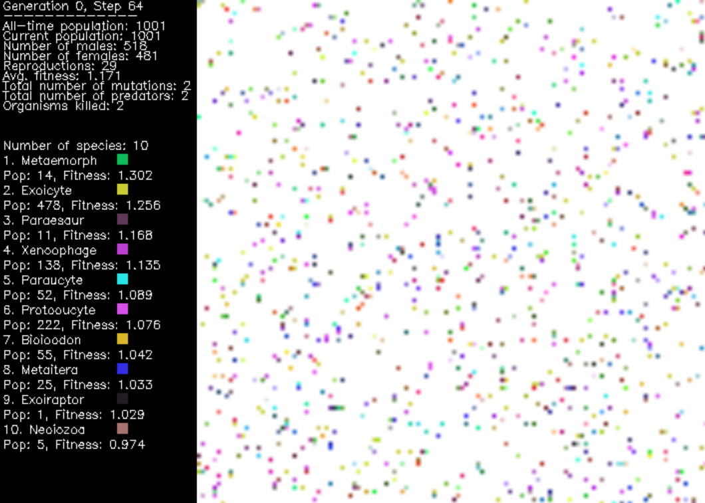

# Cellular Automata Simulator

This project is dedicated to the simulation of life-like organisms using genomes to generate
biomimetic neural networks. The purpose of this project is to observe what patterns and behavior
the digital organisms exhibit and see if they resemble real life. Although artificial 
intelligence using backpropagation to learn, it is unlikely the brain uses this 
mechanism, due to biological implausibilities. For example, networks that employ 
backpropagation are rate based instead of spiking neural nets, and violate Dale's
law: neurons in the brain form either excitatory or inhibitory connections [2]. However, 
artificial neurons are usually able to form both these connections. It is more possible
however, that in biological learning, thousands of genes are evolved over many 
generations to enable efficient learning for trillions of synapses. Hence, the simulation
of our digital organisms will operate on the basis of evolutionary algorithms.

This project is written in Python. The numpy library has been used for most of our neural
network and math operations. In addition, the opencv library has been used to render the
world frame, so that we can visualize the organisms.



### Running Simulation

Install dependencies and run simulation
```
pip install -r requirements.txt
python3 src/main.py
```

In addition to the UI, you can see the monitor for the simulation in the console when 
the main file is run.


## Design Implementation

The core of this project is built upon the foundation of evolutionary algorithms, which use
the phenomena of evolution to solve optimization problems. They have been 
used in the past for a multitude of applications, ranging from machine learning, 
agriculture, finance, research to art. One of the most popular evolutionary algorithms is
known as **Neuroevolution of Augmenting Topologies (NEAT)** [2], and this project has taken great
inspiration from it. In contrast to artificial neural networks (ANN), which generally have a fixed network
topology during both training and inference (inference might leave certain layers out 
like dropout), NEAT's network topology changes and evolves. It may start
out as a simple few neuron network with minimal connections, but at the end of the training stage,
it may be many layers deep with a significant number of synaptic connections. This is the beauty of such
evolutionary algorithms, instead of fixing our network topology, we optimize both the network
architecture and its parameters, the weights and biases. NEAT, in particular, 
has been shown to be incredibly effective for all sort of complex control tasks, 
like Pole Balancing.

There are four main steps to an evolutionary 
algorithm:

1. Generate the **initial population** of organisms randomly.
2. **Select the fittest organisms** for reproduction.
3. Breed organisms via **crossover** and **mutation** of genes to give birth to offspring.
4. Replace least-fit individuals with new individuals.


While step 4 is an extremely valuable step for an optimization problem, for the purposes
of our simulation we will ignore this, as organisms with less fitness will naturally
die out in favor of the fitter organisms (natural selection). 

Step 1 involves creating the initial population of organisms. First we must randomly
generate the **genome** for the Organism, which is a set of genes for the organism (defined
gene length). One gene can be thought of as a synaptic connection (with weight) between a source and 
sink neuron. We have a defined set of input and output neurons, as well as an arbitrary number of 
hidden neurons (set in .env file). For the time being, we do not allow any self 
and feedback connections. Once we have defined our genome, we can then build the brain
wiring. Using the genes (i.e. prospective synaptic connections) we connect the 
neurons in an adjacency matrix representation. After building the initial brain wiring, 
there may be a bunch of useless connections, for example hidden neuron not connected
to an output or input neuron. In this instance, we must cull all synaptic connections 
to this neuron, which will help save system resources. Once this is complete, the 
Organism's Neural Network is formed.

Step 2 is also a step specific to an optimization algorithm like NEAT. In our case, while there is
no such fitness check, the Organism's fertility (same species or cross-species) must be greater than
a random number between 0 and 1. The Organism's same species and cross-species fertilities 
are randomized at creation, and it is the probability that the Organism will engage in
sexual reproduction with a partner of the opposite sex. Naturally, the same species fertility
will generally be higher than the cross species fertility. Furthermore, sexual partners must be
within a certain vicinity of each other, and must be of a minimum age, in order to reproduce
successfully.

Step 3 is where the real magic happens. Once Organisms pass the criteria for reproduction, 
a process known as **crossover**, or recombination of genes begins to form the genome of the 
offspring. In a NEAT-like fashion, we compare alike genes, and select the gene from the 
fitter parent. By picking genes from the fitter parent, we are in essence optimizing the 
child's genome. It is worth an experiment in the future to have a random probability 
helping us select the gene which is transmitted to the child. If there are disjoint genes, 
we simply include all of them in the child's genome. 

Once recombination is over, perhaps the
most important process of the evolutionary algorithm occurs: **mutation**. Mutation is the equivalent 
of backpropagation in ANNs. This is incredibly powerful because 
it introduces genetic diversity, which helps organisms adapt and survive. A popular 
example of mutation is the peppered moth, also dubbed as 'Darwin's moth'. In the 19th century,
the black form of the moth became more common than its pale counterpart. This was during the 
Industrial Revolution, and the domestic coal fires had darkened the tree trunks and walls. 
The pale form of the peppered moth was easily observable to predators, and the black 
form was camouflaged, thus being able to survive and produce offspring. By 1895, 98% of peppered moths
in Manchester were black [4].


In the context of optimization, mutation in evolutionary algorithms also 
helps balance exploration vs exploitation, since by injecting randomness into the system, we 
can explore more of the search space of solutions. This also helps with avoiding premature convergence and
falling into the local minima trap. Hence, after the recombination of genes, with a relatively
low probability, mutation may take place in the child's genome.

This completes the baseline implementation of an evolutionary algorithm. Beyond this lies 
the method we use to create the neural network along with the associated input, 
output and hidden neurons. Furthermore, I will discuss the specifics of reproduction, mutation,
fitness function as well as speciation. Then we will analyze the results of the simulations and the
keys takeaways from the project. I will also list items that are worth exploring in the 
future.

## Neural Network

A **gene** can be simply thought of as a connection between a source and a sink 
neuron (along with a weight), and a collection of genes is known as the **genome**. Following is the data structure
for a gene:


These genes are prospective synaptic connections. Once the genome has been defined
(first organisms have a random set of genes), it is time to build the brain wiring. We can use 
each set of genes to fill out the adjacency matrix of neurons. This adjacency matrix
will represent our **Neural Network**, with a 0 denoting no connection and 1 denoting a connection. 
We can then use this adjacency matrix in parallel with a list of Genes, containing the source and
sink neurons as well as their synaptic weight. After this, there is one final step to complete the
Neural Network; we must cull useless connections. A useless connection is defined as such:
a hidden neuron which does not connect to either an input neuron or an output neuron (currently
no same layer connections allowed). This connection is useless as it does not contribute to
an output or action potential, and if we include it in the network, it is a waste of resources.
With this, our neural network is built and now let us discuss the underlying topology (which can change
due to mutation and recombination).

The topology of the network is that of a 3 layer network, with an input layer, hidden layer, and an
output layer. While this is the fundamental architecture, thanks to evolution, we can gain more
neurons and build all sorts of synaptic connections. However, as of now, the maximum number
of layers we can achieve is three (it is also possible to have only an input and output layer). 
In the future, we can make it so that the network can organize into an arbitrary number of 
layers, achieving more sophisticated behavior.


The activation function that we are using between the input layer and hidden layer, as well as 
between the hidden layer and the output layer is the tanh 
or hyperbolic tangent function. 


At the output I am using a softmax function, which gives us normalized multi-class probabilities.


### Neurons

The following neurons have been used in the neural network. First we evaluate the neurons at the
input layer, followed by the hidden and finally output layers.

1. **Input neurons**:
   - **Age Neuron** (#1): Sensitive to the organism's age relative to its natural time to live.
   - **Location X Neuron** (#2): Sensitive to the organism's x coordinate in the world.
   - **Location Y Neuron** (#3): Sensitive to the organism's y coordinate in the world.
   - **Genetic Similarity Neuron** (#4): Sensitive to genetic similarity in the organism's neighbourhood.
   - **Border Distance X Neuron** (#5): Sensitive to the border distance in the x-direction.
   - **Border Distance Y Neuron** (#6): Sensitive to the border distance in the y-direction.
   - **Population Density Neuron** (#7): Sensitive to the population density in the organism's neighbourhood.
   - **Last Move X Neuron** (#8): Sensitive to the last move in the x-direction.
   - **Last Move Y Neuron** (#9): Sensitive to the last move in the y-direction.
   - **Predator Detection Neuron** (#10): Sensitive to predators in the neighbourhood.
   - **Random Neuron** (#11): Generates random normalized output.

2. **Hidden neurons**: Number of identical hidden neurons defined in .env file.

3. **Output neurons**: 
   - **Move X Neuron** (#12): Move in the left/right direction.
   - **Move Y Neuron** (#13): Move in the up/down direction.
   - **Move Random Neuron** (#14): Move in a random direction.
   - **Move in Forward Direction** (#15): Move in the same direction as last move (forward).
   - **Move in Reverse Direction** (#16): Move in the opposite direction as last move (reverse).
   - **Kill forward neighbour** (#17): Kill neighbour in forward position.

The kill neuron is a special neuron as it is the only non-move output layer neuron that an Organism 
has (reproduction not considered a neuron). A gene containing this kill neuron is said to be
the predator gene, and an improves the fitness of the Organism. There are a couple of criteria 
for the kill neuron to be activated and kill a member of another species; the predator's 
fitness should be greater than the prey's and the kill probability should surpass a 
stochastically generated threshold. The number of kills positively influences an Organism's
fitness since by killing members of another species, it is protecting itself and securing more
territory for itself and its species members.

The outputs of all neurons are in the range -1 and 1 before activation function are applied. -1
corresponds to an inhibitory connection, while 1 corresponds to an excitatory connection. At the output
layer, normalized multi-class probabilities are used to construct a Categorical distribution,
and a random action is sampled according to this distribution. Instead of picking the probability
using the argmax function (like in supervised learning), this allows for a more stochastic 
policy for Organisms. 

## Reproduction / Crossover

Reproduction, particularly **sexual reproduction** (between a male and a female), at first seemed to be 
daunting task to implement in our simulator. However, thanks to NEAT, this is also not too 
complicated. We compare alike genes, and select the gene from the fitter parent. If there are 
disjoint genes, we simply include all of them in the child's genome. NEAT also has the idea of 
innovation numbers, which are essentially historical marking of genes and help easily match 
them from both parents. 


In our simulation, both intraspecies and cross-species reproduction can occur. Naturally,
intraspecies reproduction occurs with a higher probability relative to cross-species, because of
genetic compatibility. This is a constraint I have added to keep things realistic. 

## Mutation

Now let us discuss the crux of an evolutionary algorithm: **mutation**. Mutation is an operation
applied to individual genes and not genomes itself. There are two main branches of
mutation in our simulation:

1. **Structural Mutation**: Changes to the network topology itself.
   - *Addition of synapse*: A new synapse/gene is added to the genome.
   - *Removal of synapse*: A random synapse/gene is deleted from the genome.
   - *Addition of hidden neuron*: A hidden neuron is added to an existing random synapse/gene.
   - *Removal of hidden neuron*: A hidden neuron is deleted from an existing random synapse/gene.

2. **Non-Structural Mutation**: No changes to the network topology. Only the weights of a gene
are modified.
   - *Random weight delta*: A DELTA parameter is added or subtracted from the current
   gene weight.
   - *New random weight*: A completely new random weight is assigned to the gene.

The probability of mutation (structural or non-structural) is relatively low, however, when it
does occur, it can introduce profound changes in the Organism and by extension, its species.


## Fitness Function

In the context of an evolutionary/genetic algorithm, the **fitness function** is the 
objective function [10] and is what designers of a system strive to maximize. It is used to evaluate
the strength of correlation between a current solution and the ideal solution; higher fitness values
indicate a *better* solution according to the design of the system. 

For the purposes of our simulation, the fitness function can be thought of as a surrogate 
measure of an organism's ability to survive, i.e., *survivability*. Fitter organisms will tend to live longer 
and their species and offspring will survive through the generations, while those that have a
lower fitness will die out which may result in the extinction of lower fitness species.

The fitness function is computed for every organism, species and the population as a whole. In addition to the fitness 
function playing a pivotal role when organisms interact with their environment, for instance, 
predators can only kill their prey if their fitness is higher than the latter, fitness also 
allows us to benchmark and analyze the state of the simulation. Fitness gives us a great
deal of information about the place of different organisms and species in the world as well 
as separate ecosystems. We can understand more about predator-prey relations, the food chain
as well as biodiversity. Across generations, we can observe the variations in
species fitness which can inform us about how different factors affect a species' survivability 
and the extent to which the search space of different genomes has been explored.


Coefficients c<sub>1</sub>, c<sub>2</sub>, c<sub>3</sub> and c<sub>4</sub> allow us to 
adjust the weights of all 4 factors.
The fitness function we have used for the simulation is a linear combination of the organism's 
age, the average of its parents fitness, number of children, its intraspecies fertility, 
and the number of kills it has. Since parents donate the genes to the child, we
include their fitness (not fixed until both parents die), which acts like a historical marking. 
The number of children and the fertility are a measure of the organism's ability to continue its 
lineage. The number of kills is a measure of its dominance in its environment, as it 
can ward off other species and predators.

## Speciation

Speciation is the process with which a new species is created. Speciation occurs when a group 
within a species separates from other members of its species and develops its own unique 
characteristics [11]. Within our simulation, we can detect speciation by borrowing another
idea from the NEAT algorithm. The more disjoint two genomes are, the less
evolutionary history they share, and thus the less compatible they are. Therefore, we
can measure the compatibility distance δ of different genomes as a simple linear 
combination of the number of excess E and disjoint D genes, as well as the average
weight differences of matching genes W, including disabled genes [2]. 


Coefficients c<sub>1</sub>, c<sub>2</sub>, and c<sub>3</sub> allow us to adjust the weight of each of the three factors. N 
is the number of genes in th larger genome, which normalizes the genome size. 
Each existing species is represented by a random genome inside the species from the previous
generation. We compare the Organism's genome against representative genomes from each species
and compute the compatibility distance. We then place the new genome in the first species where 
δ is less than the compatibility threshold δ<sub>t</sub>. If δ exceeds 
δ<sub>t</sub>, then speciation has occurred and a new species has emerged.

In our simulation, the significance of speciation becomes evident, as it establishes a crucial 
dynamic wherein members of the same species are precluded from killing one another, 
while also emphasizing that intraspecies fertility surpasses cross-species fertility.

Speciation is the primary driver of **biodiversity** and **genetic diversity**, which enhances ecosystem 
resilience and adaptability. A prime example of speciation is the Galápagos finch (also known as Darwin's finches), which resides on 
several islands in the Galápagos archipelago [11]. Due to isolation, over millions of years, 
the finches have developed a unique beak adapted to the food they eat. Some finches have large, 
blunt beaks for cracking the hard shells of nuts and seeds, while others have long, thin beaks
that can probe into cactus flowers. Since finches are isolated from one another, they have 
developed into new species; this phenomenon is known as **allopatric speciation**.


## Design Testing and Verification

To test new functionality in the simulator, I performed some unit tests, including verification of
edge cases. After testing in isolation, I performed integration and 
system tests, by testing the new functionality in conjunction with other modules as well as 
with the entire system. At the start, there were issues particularly with circular imports, 
and I had to be more careful with the level of abstraction in the code. Some type hints
were removed, and code was written to be more modular with a hierarchical
design. Certain design patterns that I followed were the Abstract Factory, Adapter, 
Proxy and Mediator patterns.

The user interface (UI) and system monitor underwent considerable testing. The UI is simply a numpy matrix, but I 
have leveraged opencv to insert text and a species legend to see real-time stats from the simulation. The stats are all
provided by the system monitor, whose class provides a singleton object to the system, so that the data 
is consistent throughout read/writes in all modules.

The UI has changed significantly from the start of the project. Following illustrates the evolution
of the UI.

Iteration 1:


Iteration 2:


Latest iteration:


We are presenting a number of stats in the UI and console to capture crucial simulation metrics.
What is particularly interesting is the world population, average fitness, number of species
and the population and ranking of each species (species ranked by fitness in UI). In order to analyze
the simulation, I am capturing the simulation as a movie in the form of an .mp4 file, while 
concurrently logging the average fitness and population. These logged metrics will be used to 
generate visual plots for better understanding and analysis.

## Simulation Results

### Movies

I have recorded a few movies showing the results of some simulations. You can find these .mp4 files
in the assets/movies directory. The readme in the assets folder has a brief explanation for each 
movie, and for more insight, view the logs in the src/logs directory to see the parameters used in 
each simulation. The naming convention in the movies maps to the logs, for both fitness and 
population.

Movie0 was a test movie to see whether the simulation worked as intended and whether we could
capture video. 

In movie1 you can see the organisms form clusters or **colonies** after generation 0 has died. 
It is interesting to see that the dominant species (both in fitness and population) makes up most
of these colonies.


Movie2 is a case of insufficient genetic diversity and rate of reproduction. Only around 80
organisms are alive once generation 0 passes away. Since there are too few organisms distributed
over a relatively large world area and an unbalanced sex ratio, organisms are unable to 
find mates of the opposite gender. As a result, total extinction occurs, and life is unable
to continue.

Movie3 is another case where colonies have formed after a few generations. Similar to movie1, 
there is a species which is dominant in terms of population, however, it is least-fit species.

Movie4 is most similar to movie3, but intriguingly forms colonies on the world border.


Movie5 shows similar behavior to movie4. However, this time the simulation begins with 42 
distinct species, as I narrowed the COMPATIBILITY_THRESH parameter, which means there are more organisms
likely to be genetically incompatible with existing species.

Movie 6 is one of the most impressive results I have observed. In this simulation, the 
starting population was around 300. Despite a sudden decline in the population to 100, due 
to generation 0 dying out, the world is able to repopulate itself, and form complex
colonies, composed of different species. After 10 generations, the world reaches a population of
2000 organisms, in spite of a tremendous wipe out at the start, indicating the strength of
biodiversity and fertility of organisms. Also note that as colonies form, predation does not
occur and species help one other to expand the colony.


I wanted to conduct one experiment with a greater starting gene length, and thus doubled the initial
gene length from 8 to 16. This increase in gene length means that organisms have more
synaptic connection, and are thus more sophisticated. This movie had similar results to movie 4, where one colony is 
formed along the border. However, it is significant that within 2 generations, only 1 species
survives with all others dying out. This dominant species is incredibly predatory, as it kills
much of the other world species. One takeaway from this experiment is that more sophisticated
species are likely to kill the others to protect their own.

## Population and Fitness Plots

In this section I will feature the population and fitness plots from three of the most interesting 
movie results. 


The plot from movie 1 shows that the world population recovers despite generation 0 dying out. 
We also notice that the fitness increase monotonically with respect to time. After much of
the population dies out (generation 0), the fitness undergoes an incline, showing that the
more fit organisms and species survive while the less fit are killed: **natural selection**.


The plot from movie 6 shows the recovery of population much like the plot in movie 1. 
Note that unlike the fitness in movie1, the fitness in movie6 reaches a convergence, which 
might be because species are well homogenized and instead of trying to compete (no predation),
have a **symbiotic relationship**.


Movie7 shows similar trends to movie1, however, this time, instead of natural selection
choosing multiple species, only one is chosen. Another interesting note is that magnitude
of fitness is small relative to movie1. In the context of optimization, we could attribute this
to the elimination of much of the search space prematurely, and getting trapped in a local
minima.

## Conclusion and Future Work

In summary, I've developed a sophisticated biological simulator designed for emulating living systems. 
The simulator employs a meticulously crafted genome to construct neural networks for each organism.
Using the principles of evolution, the system selectively prunes less fit organisms, 
allowing the fitter ones to propagate their genetic traits through procreation.

The simulations vividly depict various biological phenomena, including the emergence of colonies, 
symbiotic relationships, and natural selection. Notably, diverse species 
showcase the capacity to collaborate and establish intricate colonies devoid of predation. These
colonies consist of species in symbiotic relationships. In contrast, some simulations 
contain predatory species that, driven by the forces of natural selection, 
eliminate all other organisms within their ecosystem.

This project has been transformative and has pushed my boundaries as an engineer and student. In the
future, I wish to record longer simulations for a few hundred or thousand generations, which will
allow us to visualize evolution more clearly. This will require significant code optimizations for the GPU,
which will parallelize more operations. I might even have to run the code on a more powerful machine
for the simulation to terminate in a reasonable period of time.

I also wish to expand on the current project, and add more complexity such as food and a hunger
function. This would motivate organisms to evolve to find food in different ways, whether as a 
carnivore, omnivore or herbivore. In addition, I wish to add more complex organisms to
the simulator, specifically multicellular organisms. I have already tried creating multicellular
snake-like organisms which is present in the snake branch of this repository.


## References

[1] Lillicrap, T.P., Santoro, A., Marris, L. et al. Backpropagation and the brain. Nat Rev 
Neurosci 21, 335–346 (2020). https://doi.org/10.1038/s41583-020-0277-3

[2] K. O. Stanley and R. Miikkulainen, "Evolving Neural Networks through Augmenting 
Topologies," in Evolutionary Computation, vol. 10, no. 2, pp. 99-127, June 2002, 
doi: 10.1162/106365602320169811.

[3] Ashlock, D. (2006), Evolutionary Computation for Modeling and Optimization, 
Springer, New York, doi:10.1007/0-387-31909-3 ISBN 0-387-22196-4.

[4] “Peppered Moth and Natural Selection.” Butterfly Conservation, 
butterfly-conservation.org/moths/why-moths-matter/amazing-moths/peppered-moth-and-natural-
selection. Accessed 9 Dec. 2023. 

[5] Miller, David Randall. “I Programmed Some Creatures. They Evolved.” 
YouTube, YouTube, 13 Dec. 2020, www.youtube.com/watch?v=N3tRFayqVtk&amp;list=LL&amp;index=8&amp;t=2222s. 

[6] Shorten, Connor. “Neuroevolution of Augmenting Topologies (NEAT).” 
YouTube, YouTube, 27 Aug. 2019, www.youtube.com/watch?v=b3D8jPmcw-g&amp;list=LL&amp;index=7&amp;pp=gAQBiAQB.

[7] Soni, Devin. “Introduction to Evolutionary Algorithms.” Medium, Towards Data Science, 
23 June 2021, towardsdatascience.com/introduction-to-evolutionary-algorithms-a8594b484ac. 

[8] H, Roshna S. “Hyperparameters in Machine Learning.” Intuitive Tutorials, 27 Mar. 2023, 
intuitivetutorial.com/2023/03/26/hyperparameters-in-machine-learning/. 

[9] Nikola. “Neat Algorithm from Scratch (It Was Hard).” YouTube, YouTube, 4 Oct. 
2023, www.youtube.com/watch?v=lAjcH-hCusg&amp;list=LL&amp;index=6&amp;t=664s. 

[10] “Evaluation Phase.” Evaluation Phase - Generative Design Primer, 
www.generativedesign.org/02-deeper-dive/02-04_genetic-algorithms/02-04-03_evaluation-phase. 
Accessed 10 Dec. 2023. 

[11] “Speciation.” Education, education.nationalgeographic.org/resource/speciation/. 
Accessed 11 Dec. 2023. 

[12] Carylsue. “One of ‘Darwin’s Finches’ Struggles to Survive.” 
National Geographic Education Blog, 22 June 2018, 
blog.education.nationalgeographic.org/2015/05/12/one-of-darwins-finches-struggles-to-survive/. 